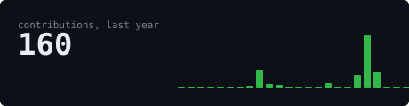
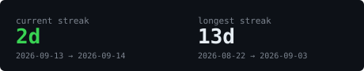
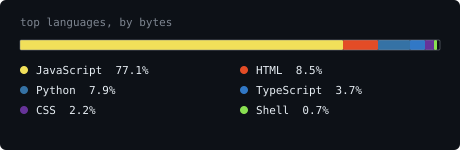
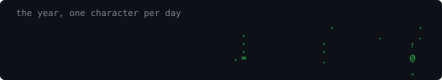

 

<blockquote>
Student at MNNIT Allahabad (Prayagraj). C++ / Python / MERN. 
Competitive programming, DSA, and hackathons — currently searching 
for a Summer 2027 SDE internship.
</blockquote>

 

 

<samp>C++ &nbsp;·&nbsp; Python &nbsp;·&nbsp; JavaScript &nbsp;·&nbsp; React &nbsp;·&nbsp; Node.js &nbsp;·&nbsp; Express &nbsp;·&nbsp; MongoDB</samp>

  

Every graphic on this page is generated inside
<a href="https://github.com/Ayushk212/Ayushk212">this repository</a>
by a scheduled GitHub Action. Zero third-party requests.

